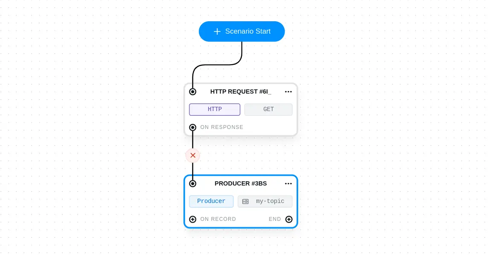

# Chaining tasks

You can chain tasks by clicking on the start node or a **task output port**, then selecting the task type to create.

For example, Consumer tasks have 2 output ports:

- **on record** will trigger the next task on each record consumed. The record data will be accessible in the next task
- **on end triggers** the next task when the consumer lifecycle ends. Consumed records are not accessible to subsequent tasks

You can find more details on available ports per task type in [this document](tasks/task-ports).

Links can be deleted by clicking on the cross icon in the middle of a line:

You can create new links by drawing a line (dragging) from the output port of a task to the input port of another task:

You can do joins simply by having multiple parents for a task. In this case, the child task will only be triggered when each parent emitted a new event

## Accessing the output

You can access the parent events in the child task. For example, if you chain an HTTP Request task with a Producer task, you will be able to produce data coming from the HTTP response.

:::info
Looking for how to access the **current** task data in Checks ? Here is the [documentation](test-checks/accessing-kafka-message-data)
:::

Using the previous task data is easy, but requires some documentation until we complete a simple integration in the UI.

Each task defines a reference. _You can modify it, but in the current version you will need to update manually the tasks referencing it, so proceed with caution._

You can no use this reference in the direct children tasks, using our JQ or Javascript inputs.

Template will be added soon, with an UI-friendly way to select the corresponding parent.

The event is accessible on the following paths :

- in JQ: \
  `.source.the_task_reference.xx` \
  ``so with our producer example you can access the record key with `.source.awesome_producer.record.key`
- in javascript: \
  `context.source.the_task_reference.xx`

For convenience, you can copy the reference of a task on the canvas at any time :

.png>)

### Accessible properties per task type 

For readability, we've omitted the `.source.the_task_reference.` prefix when describing the available properties below.

#### Kafka Consumer and Producer

- `.record.key` : the key of the record.
  - If it is a data structure (JSON, Avro, Proto etc), you can access sub-properties directly, ex: `record.key.some_property`
- `.record.value` : the value of the record, works the same way as .`record.key`
  - A full example of accessing a record data from a child task using JQ : `.source.awesome_producer.record.value.some_property`

Record metadata is also accessible:

- `.record.partition`
- `.record.offset`
- `.record.headers` : a list of `{key: string, value: string}`
- `.record.timestamp`

#### HTTP Task

- `.httpResponse.body` : The body of the response. If JSON, you can access the properties directly.\
  For example, if your task reference is `my_http` and the response is `{ "order_id": 123 }` , you can access it in the child task using the following JQ : `.source.my_http.httpResponse.body.order_id`
- `.httpResponse.code` : the status code of the HTTP response, example: 200

Some HTTP response metadata is also accessible:

- `.httpResponse.headers` : a list of `{key: string, value: string}`
- `.httpResponse.responseSizeBytes`
- `.httpResponse.callDurationMillis`
